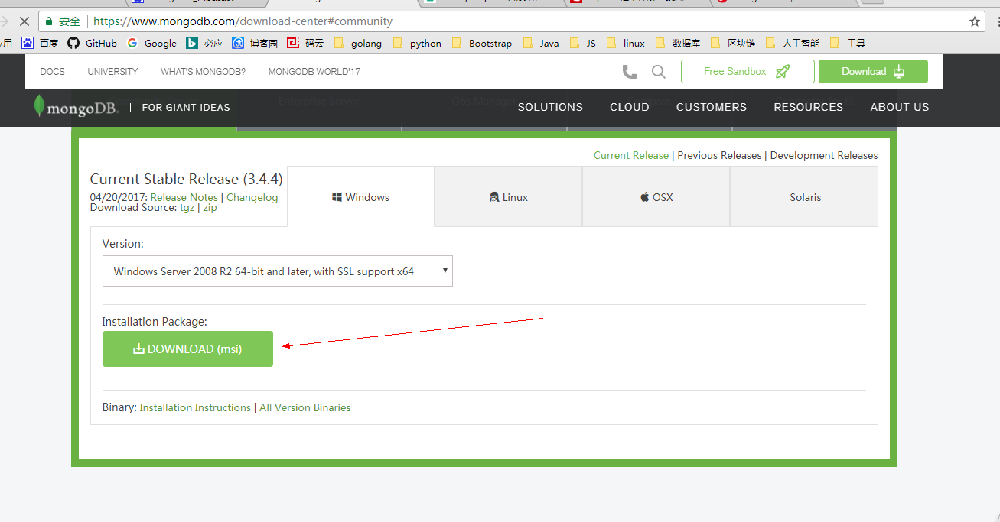
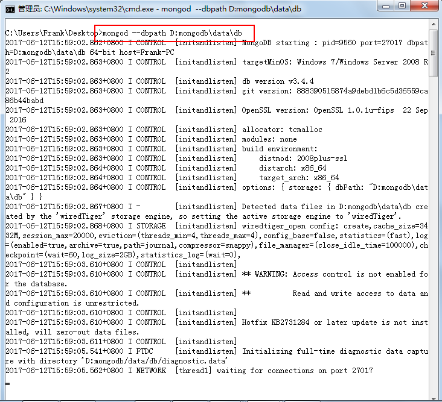
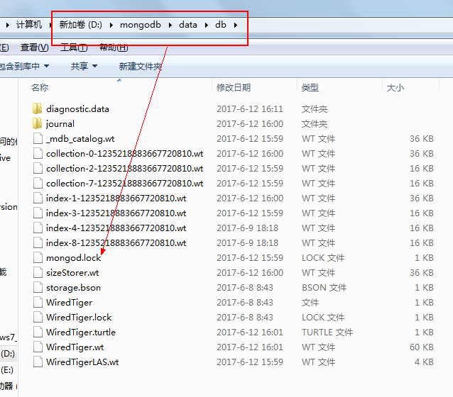
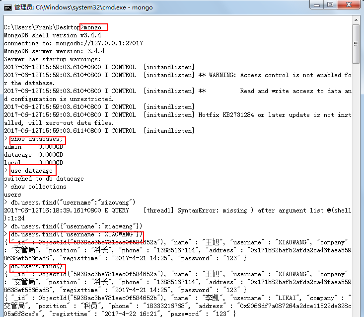
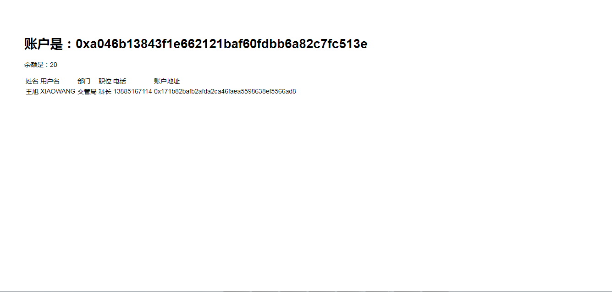
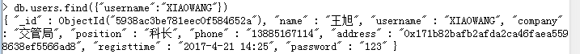

#安装mongoDB插入测试数据#

以太坊中用到mongoDB的地方并不多，这里只是说明，区块链不适合存储大量和查询频率比较高的，建议只使用区块链记录关键数据，其他基本信息存储在mongoDB中。例如：区块链设置一个新帐号address,将其账户的基本信息，如用户名、真实姓名、电话、家庭住址等等存放在mongoDB中。

##一 、下载安装##
###1.下载###
mongoDB官方下载地址：[https://www.mongodb.com/download-center#community](https://www.mongodb.com/download-center#community "mongoDB官方下载地址")

下载后点击安装即可，尽量选择默认安装路径。然后在D盘新建文件夹存储mongoDB数据库D:\mongodb\data\db。安装完成后启动服务，使用的命令是：mongod --dbpath D:mongodb\data\db。这里设置的路径与真实的文件路径保持一致。执行后会显示，如下图：

有时会启动失败，很可能是因为上次关闭时没有正常退出，出现了锁文件，删除他即可。

###2.开启命令行测试###
我们首先在命令行中测试几行mongodb的简单方法。
	
	1.mongo //启动命令行交互模式
	2.show databases //查看所有的数据库，创建和删除数据库命令自行学习
	3.use datacage //选择使用datacage数据库
	4.show collections //查看所有数据表
	5.db.users.find({"username":"XIAOWANG"}) //查询用户名为XIAOWANG的数据记录
	6.db.users.find() //查询数据表中所有的数据记录

具体操作如下图：

## 二 在express框架中具体使用##

###1.插入测试数据###
再插入数据时一定要注意数据的格式，为了测试方便，我全部使用了字符串的格式，甚至日期也是以字符串的形式，自拟的。后期优化需要修改过来。还有一个要注意这里的address不能虚构，要与你的以太坊节点帐号一致，否则对接不上。	

	use datacage; //如果存在会选择使用，如果不存在会创建一个数据库
	db.createCollection("users") //创建一个数据集合，类似数据表
	//插入数据
	db.users.insert({name:"王旭",username:"XIAOWANG",company:"交管局",position:"科长",phone:"13885167114",address:"0x171b82bafb2afda2ca46faea5598638ef5566ad8",registtime:"2017-4-21 14:25",password:"123"})
	db.users.insert({name:"李凯",username:"LIKAI",company:"交管局",position:"科员",phone:"18333216768",address:"0x9066df7a087264a2dce11522de328c05a6f8cefe",registtime:"2017-4-22 16:21",password:"123"})
	db.users.insert({name:"石富伦",username:"FULUN",company:"交管局",position:"科员",phone:"13599880909",address:"0xaab3132223f1706066a2c33c721c7efdad198abf",registtime:"2017-4-23 12:14",password:"123"})
	db.users.insert({name:"易旺",username:"YIWANG",company:"交管局",position:"科员",phone:"13988994545",address:"0xed2862713af7fd33a011c03c76dee5228406a989",registtime:"2017-4-23 13:45",password:"123"})
	db.users.insert({name:"李东",username:"LIDONG",company:"交管局",position:"科员",phone:"13245678789",address:"0x418cbeea46d1ba49f7177d905cec2b795178bd77",registtime:"2017-4-23 14:28",password:"123"})
	db.users.insert({name:"田树选",username:"TIANSHU",company:"交管局",position:"科员",phone:"13235358990",address:"0x0b6fc9d5977e4903327939309c00c0f434b158ac",registtime:"2017-4-23 15:32",password:"123"})
	db.users.insert({name:"梁龙军",username:"LONG",company:"交管局",position:"科员",phone:"13277889009",address:"0x32f1db9074c2d839929493d3eaa08ee6a6a7d3b1",registtime:"2017-4-23 15:39",password:"123"})
	db.users.insert({name:"颜利冲",username:"LICHONG",company:"交管局",position:"科员",phone:"13268321435",address:"0xb74b7440963c7f35c66cbb50ec5773f3fc58ce31",registtime:"2017-4-23 16:30",password:"123"})
	db.users.insert({name:"武剑",username:"WUJIAN",company:"交管局",position:"科员",phone:"13267678989",address:"0xea7d574681746a725c129be225199e0613614393",registtime:"2017-4-23 16:51",password:"123"})

###2.安装mongoose模块###
此模块支持nodejs和express对mongodb数据库进行操作。例如用到的最多的增删改查等等。
		
	var mongoose = require('mongoose');//导入mongoose模块

在App项目文件夹中建一个文件夹models，用于存放数据模型，原则上是一个表一个文件，例如我的用户表，就用一个users.js文件来写，这个文件类似java的mapping,也类似ORM映射文件，将程序中的user对象，映射到数据库中的数据表中。

	var mongoose = require('mongoose');
	  //申明一个mongoos对象
	 var UsersSchema = new mongoose.Schema({
	     name:String,
	     username:String,
	     company:String,
	     position:String,
	     phone:String,
	     address:String,
	     registtime:String,
	     password:String,
	     meta: { 
	          createAt: {
	              type: Date,
	            default: Date.now()
	         },
	        updateAt: {
	             type: Date,
	             default: Date.now()
	        }
	     }
	 })
	 //每次执行都会调用,时间更新操作
	 UsersSchema.pre('save', function(next) {
	     if(this.isNew) {
	         this.meta.createAt = this.meta.updateAt = Date.now();
	     }else {
	         this.meta.updateAt = Date.now();
	     }
	     next();
	 })
	 //查询的静态方法
	 UsersSchema.statics = {
	
	     fetch: function(cb) { //查询所有数据
	         return this
	           .find()
	           .sort('meta.updateAt') //按更新时间排序
	           .exec(cb) //回调
	     },
	     findByaddress: function(address, cb) { //按照帐号地址查找
	         return this
	           .findOne({address: address})          
	           .exec(cb)
	     },
	     findByusername: function(username, cb) { //按照用户名查找
			return this
	           .findOne({username: username})          
	           .exec(cb)
	     },
	     findBypage: function(page,cb){//简单的分页查询，6条数据为一页
	         return this
	             .find().sort('meta.updateAt').skip((page-1)*6).limit(6).exec(cb);
	     },
	     findBypage2: function(page,cb){//简单的分页查询，8条数据为一页
	         return this
	             .find().sort('meta.updateAt').skip((page-1)*8).limit(8).exec(cb);
	     }
	 }
	var User = mongoose.model('User',UsersSchema) // 编译生成Model 模型
	//暴露出去的方法
	module.exports = User
###3 修改路由文件###

	var express = require('express');
	var router = express.Router();
	//引用web3模块
	var Web3 = require('web3');
	//创建web3实例
	var web3 = new Web3();
	//创建http连接到区块链
	web3.setProvider(new web3.providers.HttpProvider('http://localhost:8545'));
	//获得区块链主账户
	var User = require('../models/users');//导入模型数据模块
	//mongodb模块
	var mongoose = require('mongoose');
	mongoose.connect('mongodb://127.0.0.1:27017/datacage'); //连接到一个test的数据库
	/* GET home page. */
	router.get('/', function(req, res, next) {
	//获取帐号
	 var account = web3.eth.accounts[0];
	//获取帐号的余额，使用的固定web3的api，参考相关文档
	  var balance = web3.fromWei(web3.eth.getBalance(web3.eth.accounts[0]),'ether');
	//用mongoos获取数据
	User.findByusername("XIAOWANG",function(err, user) {
        if(err) {
             console.log(err);
         }
         console.log(user);
	res.render('index', { account: account,balance:balance,user:user});
	});
	});
	module.exports = router;

###4 修改视图页面views/index.html###
上面的路由返回了一个user对象，这个对象可以利用模版引擎放到页面中。

	<!DOCTYPE html>
	<html>
	<head>
	   <title>账户余额</title>
	   <link rel='stylesheet' href='/stylesheets/style.css' />
	</head>
	<body>
	   <h1>账户是：<%= account %></h1>
	   
余额是：<%= balance %>

	   <table>
	   	<tr>
	   		<td>姓名</td>
	   		<td>用户名</td>
	   		<td>部门</td>
	   		<td>职位</td>
	   		<td>电话</td>
	   		<td>账户地址</td>
	   	</tr>
	   	<tr>
	   		<td><%= user.name%></td>
	   		<td><%= user.username%></td>
	   		<td><%= user.company%></td>
	   		<td><%= user.position%></td>
	   		<td><%= user.phone%></td>
	   		<td><%= user.address%></td>
	   	</tr>
	   </table>
	</body>
	</html>

最后执行的结果为：

可以看到页面的数据和数据库一致。

