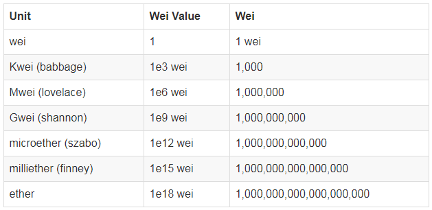
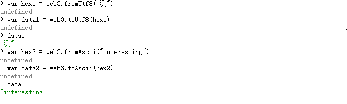

#web3.js的使用#

本课不详细说明web3.js的所有API,只讲解，web3.js如何在nodejs的express框架下使用，在做的几个项目原型中都使用了哪些web3.js的API,以及注意事项。

##一 、web3##

###1.添加模块###

前面已经讲过，想使用某个功能模块，必须先添加这个模块，所以我们使用时先使用npm添加模块。-save是将模块添加到packge.json的dependencies中。
	
	npm install -save web3 

###2.引用模块###

nodejs的一般引用模块的语句 var m = require("m")。

	//引用web3模块
	var Web3 = require('web3');
	//创建web3实例
	var web3 = new Web3();
	//创建http连接到以太坊
	web3.setProvider(new web3.providers.HttpProvider('http://localhost:8545'));

###3.web3常用api###

在以太坊控制台中，使用web3的api不需要在前面加web3.，但是在Nodejs中使用，必须要用web3对象去调用。有时候忘写，程序会报错。
	
     1.var account = web3.eth.accounts[0]; //使用[0]索引获取主账号
	 2.var accountArray = web3.eth.accounts;  //获取帐号数组，用于在页面罗列本节点所有账户
	 3.var balanceInWei = web3.eth.getBalance(web3.eth.accounts[0]) //使用此方法获得的balance余额是以wei为单位的。

下图是一个单位表，具体的请参考：[http://www.jianshu.com/p/b56552b1d1a0](http://www.jianshu.com/p/b56552b1d1a0 "单位转换")

	 
	 4.var balanceInEther = web3.fromWei(web3.eth.getBalance(web3.eth.accounts[0]),'ether'); //将账户余额从wei转换到ether,转换成其他的单位只需要替换'ether'。
	 5.var number = web3.toDecimal('0x15');//十六进制字符串转为十进制数字。
	   console.log(number); //21
     6.var value = web3.fromDecimal('21');十进制数字或者十进制字符串转为十六进制
       console.log(value); // "0x15"
	 7.var address = web3.personal.newAccount("输入你的密码")
	 8.web3.personal.unlockAccount(address,"密码"，1000)。 //反生交易时，账户必须解锁，可以设置解锁时间为1000s，
	 9.var flag = web3.eth.mining //查看是否正在挖矿
	 10.admin.nodeInfo //查看节点信息
	 11.admin.addPeer(enode) //添加节点，如果是局域网，将ip地址更换为局域网ip
     12.web3.eth.sendTransaction({from:account1,to:account2,value:web3.toWei(1,"ether")}) //转账交易
     13.web3.txpool.status //在命令行中可以看到，pending显示目前等待打包的交易数量
下图是txpool.status在命令行中，pending显示目前等待打包的交易数量。

	 
     14.var blockNumber = web3.eth.blockNumber; //获取目前的区块总量
     15.var blockInfo = web3.eth.getBlock(blockNumber); //通过块高获取某区块信息
     16.var transactionsArray = blockInfo.transactions; //获取区块中的所有交易hash，返回值为一个列表。
     17.var transactionInfo = web3.eth.getTransaction(hash);//通过交易hash查询交易信息,然后可以通过交易信息，查询其内部各字段的值。
     18.//在交易中添加一些data,会保存在transaction.input中。这些信息必须是hex格式，十六进制表示的数据。
        var hex1 = web3.fromUtf8(data1);//中文数据
		var hex2 = web3.fromAscii(data2);//英文数据
        //如果想返回真实数据
        var data1 = web3.toUtf8(hex1);
        var data2 = web3.toAscii(hex2);

##二 、web3admin##

如果你的应用涉及到挖矿，也就是说让用户在页面控制挖矿，停止挖矿，必须要使用web3admin模块来扩展web3模块。

###1.添加web3admin模块###

     npm install web3admin -save

###2.引用此模块###

web3admin模块只是用来扩展web3的功能的，实际的api还是使用web3来调用。
     
     var Web3 = require('web3');
     var web3 = new Web3();
     var web3Admin = require('web3admin');
     web3Admin.extend(web3);//扩展web3模块
     web3.setProvider(new web3.providers.HttpProvider('http://localhost:8545'));
     var flag = web3.eth.mining; //判断是否挖矿
     web3.miner.start();//开启挖矿
     web3.miner.stop();//停止挖矿

###3.实际代码示例###

     <!DOCTYPE html>
	<html lang="zh-CN">
	  <head>
	    <meta charset="utf-8">
	    <meta http-equiv="X-UA-Compatible" content="IE=edge">
	    <meta name="viewport" content="width=device-width, initial-scale=1">
	    <title>以太尔钱包</title>
	    <!-- Bootstrap -->
	    <link href="css/bootstrap.min.css" rel="stylesheet">
	    <!--你自己的样式文件 -->
	    <link href="css/style.css" rel="stylesheet">
	    
	  </head>
	  <body>
	    

	      <header class="header HeadHasBot">
	        

	            <ul class="nav nav-pills">
	              <li role="presentation" class="active"><a href="#">钱包&nbsp;</a></li>
	              <li role="presentation"><a href="#">区块交易&nbsp;</a></li>
	              <li role="presentation"><a href="#">设置&nbsp;</a></li>
	            </ul>
	        

	      </header>
	      <!-- 区块链详情内容区 -->
	      <section class="profile container blockBg" style="font-size: 12px;">
	        

	          

	            

	            

	              
&nbsp;账户:&nbsp;

	              
&nbsp;&nbsp;余额:&nbsp;

	            

	          

	          

	            <!--
开启挖矿
-->
	            <form class="form-horizontal" enctype="multipart/form-data" id="form3">
	              

	                <label class="col-sm-3 control-label"></label>
	                

	                  <input type="text" class="form-control" id="sender" name="sender" placeholder="发送者">
	                  <i class="glyphicon glyphicon-user glyphicon-user-0"></i>
	                

	              

	              

	                <label class="col-sm-3 control-label"></label>
	                

	                  <input type="text" class="form-control" id="reciever" name="reciever" placeholder="接收者">
	                  <i class="glyphicon glyphicon-user glyphicon-user-1"></i>
	                

	              

	              

	                <label class="col-sm-3 control-label"></label>
	                

	                  <input type="text" class="form-control" id="ether" name="ether" placeholder="以太尔">
	                  <i class="glyphicon glyphicon-usd glyphicon-user-2"></i>
	                

	              

	               

	                <label class="col-sm-3 control-label"></label>
	                

	                  <input type="password" class="form-control" id="password" name="password" placeholder="请输入账户密码">
	                

	              

	              

	                <input class="btn btn-success" type="button"  onclick="sendTransaction()" value="转账">
	                <input class="btn" type="button" onclick="miner()"  id="mining" value="开始挖矿">
	                <input class="btn" type="button" onclick="stop()"  id="stopMining" value="暂停挖矿">
	              

	            </form>
	          

	        

	        <!-- /row -->
	      </section>
	    

	     
	     <!-- Insert this line above script imports  -->
	     
	     
	  </body>
	</html>

###4.应用效果###

这是一个桌面钱包应用，是使用Electron制作的，里面也是网页，只是放在了小的Chrome浏览器中。有兴趣可以研究一下，在第七课中会有教详细的介绍。
