#开发实战--积分交易系统原型
积分交易系统原型只是一个项目原型，没有持久化的数据库，没有真实的账户体系，也没有自动计算积分价格，只有通过代币智能合约产生的积分A,积分B,积分C三种积分之间的互相兑换，这个兑换比例也是写死在程序中，没有自己设置的地方，也就是一旦确定不能更改，后期可以根据业务进行更改。还有的功能就是：积分兑换商品，不同种类积分互兑，积分赠送转账，另外还镶嵌了一个小型的浏览器，可以查看区块量和区块的基本信息，如果区块中有交易，可以点击区块hash查看本区块的交易量和基本信息，如果想做的更详细，可以多获取数据展现在页面上。本节课就从无到有开始完成这个项目。
##一、项目初始化
###1.项目初始化，与之前一模一样，只是换个项目名。

	express -e tokenScore
	cd tokenScore&&npm install
	npm install web3 web3admin -save
	SET DEBUG=tokenScore:*&npm start
查看localhost:3000页面，没有错误说明成功了。然后修改模版引擎后缀名为我们熟悉的html文件。在项目目录的根目录下，找到程序入口文件app.js，修改相关代码。对于这个小项目，这个文件只需要修改这一个地方，而且如果你想用ejs的文件作为页面，连这个地方都不用修改。

	var express = require('express');
	var path = require('path');
	var favicon = require('serve-favicon');
	var logger = require('morgan');
	var cookieParser = require('cookie-parser');
	var bodyParser = require('body-parser');
	
	var index = require('./routes/index');
	var users = require('./routes/users');
	
	var app = express();
	
	//这里是原来的模版引擎代码
	// view engine setup
	//app.set('views', path.join(__dirname, 'views'));
	//app.set('view engine', 'ejs');
	
	//模版引擎改造为html后缀
	// view engine setup
	app.set('views', path.join(__dirname, 'views'));
	app.engine('html',ejs.__express);
	app.set('view engine', 'html');
	
	// uncomment after placing your favicon in /public
	//app.use(favicon(path.join(__dirname, 'public', 'favicon.ico')));
	app.use(logger('dev'));
	app.use(bodyParser.json());
	app.use(bodyParser.urlencoded({ extended: false }));
	app.use(cookieParser());
	app.use(express.static(path.join(__dirname, 'public')));
	
	app.use('/', index);
	app.use('/users', users);
	
	// catch 404 and forward to error handler
	app.use(function(req, res, next) {
	  var err = new Error('Not Found');
	  err.status = 404;
	  next(err);
	});
	
	// error handler
	app.use(function(err, req, res, next) {
	  // set locals, only providing error in development
	  res.locals.message = err.message;
	  res.locals.error = req.app.get('env') === 'development' ? err : {};
	
	  // render the error page
	  res.status(err.status || 500);
	  res.render('error');
	});
	
	module.exports = app;
###2.准备素材
1.这个项目的样式使用了前端样式框架Bootstrap,下载地址：[http://getbootstrap.com/](http://getbootstrap.com/ "Bootstrap官方下载")将下载下来的文件解压后获得的Bootstrap文件夹放在public文件夹下。 
2.准备一张头像图片。 
3.准备样式文件，可以直接拷贝项目中的main.css和style.css。样式文件属于东拼西凑的，可以自己写。 
4.下载jquery在引用Bootstrap.min.js之前引用Jquery，因为这个框架依赖Jquery.Jquery官方下载：[http://jquery.com/](http://jquery.com/ "Jquery官方下载")，Jquery插件下载：[http://www.jq22.com/](http://www.jq22.com/ "Jquery插件下载")/ 
5.下载Echarts.min.js文件，这是一个js插件库，有很多可以直接拿来用的图标插件。在图形化展示页面时大有用处。Echarts下载：[http://echarts.baidu.com/](http://echarts.baidu.com/ "Echats官网")
##二、编写部署代币合约
###1.编写代币合约
我们从以太坊官网可以找到：[https://ethereum.org/token#the-code](https://ethereum.org/token#the-code "代币合约")官方提供的权威的代币合约，我们只需要搞明白怎么转账和消耗就可以了，代币合约代码如下：

	contract tokenRecipient { function receiveApproval(address _from, uint256 _value, address _token, bytes _extraData); }
	
	contract MyToken {
	    /* Public variables of the token */
	    string public standard = 'Token 0.1';
	    string public name;
	    string public symbol;
	    uint8 public decimals;
	    uint256 public totalSupply;
	
	    /* This creates an array with all balances */
	    mapping (address => uint256) public balanceOf;
	    mapping (address => mapping (address => uint256)) public allowance;
	
	    /* This generates a public event on the blockchain that will notify clients */
	    event Transfer(address indexed from, address indexed to, uint256 value);
	
	    /* This notifies clients about the amount burnt */
	    event Burn(address indexed from, uint256 value);
	
	    /* Initializes contract with initial supply tokens to the creator of the contract */
	    function MyToken(
	        uint256 initialSupply,
	        string tokenName,
	        uint8 decimalUnits,
	        string tokenSymbol
	        ) {
	        balanceOf[msg.sender] = initialSupply;              // Give the creator all initial tokens
	        totalSupply = initialSupply;                        // Update total supply
	        name = tokenName;                                   // Set the name for display purposes
	        symbol = tokenSymbol;                               // Set the symbol for display purposes
	        decimals = decimalUnits;                            // Amount of decimals for display purposes
	    }
	
	    /* Send coins */
	    function transfer(address _to, uint256 _value) {
	        if (_to == 0x0) throw;                               // Prevent transfer to 0x0 address. Use burn() instead
	        if (balanceOf[msg.sender] < _value) throw;           // Check if the sender has enough
	        if (balanceOf[_to] + _value < balanceOf[_to]) throw; // Check for overflows
	        balanceOf[msg.sender] -= _value;                     // Subtract from the sender
	        balanceOf[_to] += _value;                            // Add the same to the recipient
	        Transfer(msg.sender, _to, _value);                   // Notify anyone listening that this transfer took place
	    }
	
	    /* Allow another contract to spend some tokens in your behalf */
	    function approve(address _spender, uint256 _value)
	        returns (bool success) {
	        allowance[msg.sender][_spender] = _value;
	        return true;
	    }
	
	    /* Approve and then communicate the approved contract in a single tx */
	    function approveAndCall(address _spender, uint256 _value, bytes _extraData)
	        returns (bool success) {
	        tokenRecipient spender = tokenRecipient(_spender);
	        if (approve(_spender, _value)) {
	            spender.receiveApproval(msg.sender, _value, this, _extraData);
	            return true;
	        }
	    }        
	
	    /* A contract attempts to get the coins */
	    function transferFrom(address _from, address _to, uint256 _value) returns (bool success) {
	        if (_to == 0x0) throw;                                // Prevent transfer to 0x0 address. Use burn() instead
	        if (balanceOf[_from] < _value) throw;                 // Check if the sender has enough
	        if (balanceOf[_to] + _value < balanceOf[_to]) throw;  // Check for overflows
	        if (_value > allowance[_from][msg.sender]) throw;     // Check allowance
	        balanceOf[_from] -= _value;                           // Subtract from the sender
	        balanceOf[_to] += _value;                             // Add the same to the recipient
	        allowance[_from][msg.sender] -= _value;
	        Transfer(_from, _to, _value);
	        return true;
	    }
	
	    function burn(uint256 _value) returns (bool success) {
	        if (balanceOf[msg.sender] < _value) throw;            // Check if the sender has enough
	        balanceOf[msg.sender] -= _value;                      // Subtract from the sender
	        totalSupply -= _value;                                // Updates totalSupply
	        Burn(msg.sender, _value);
	        return true;
	    }
	
	    function burnFrom(address _from, uint256 _value) returns (bool success) {
	        if (balanceOf[_from] < _value) throw;                // Check if the sender has enough
	        if (_value > allowance[_from][msg.sender]) throw;    // Check allowance
	        balanceOf[_from] -= _value;                          // Subtract from the sender
	        totalSupply -= _value;                               // Updates totalSupply
	        Burn(_from, _value);
	        return true;
	    }
	}

请仔细阅读该网页的所有内容，包括每一个字，读完后大致会对代币合约会有一个理解[https://ethereum.org/token#the-code](https://ethereum.org/token#the-code "代币合约")

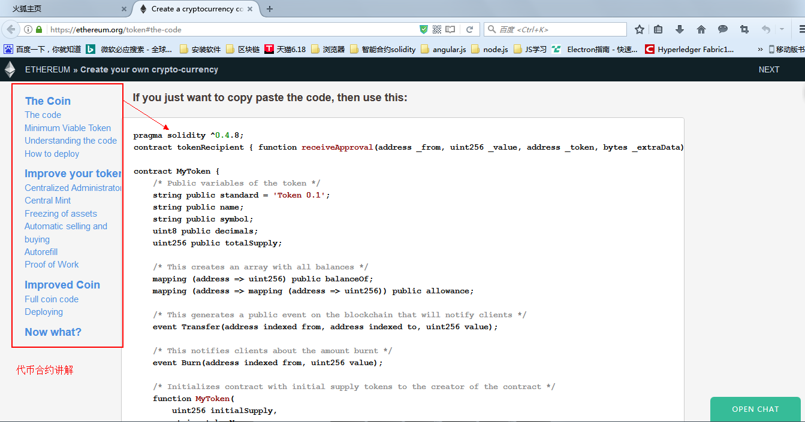

###2.部署代币合约
部署代币合约使用Ethereum Wallet钱包最为方便直观。
1.启动私链,在你的geth.exe程序的根目录中，shift+鼠标右键启动命令行，输入以下命令，尤其注意rpcapi 中的几个参数，db，eth,net,web3,personal,miner只有在启动时启动了这几个远程调用的rpcapi。

    geth --identity "szetherum"  --rpc  --rpccorsdomain "*" --datadir "chain" --port "30303"  --rpcapi "db,eth,net,web3,personal,miner"  --networkid 6500 console 2>1.txt
2.打开Ethereum Wallet钱包，如果安装正确的话，会直接找到本地已启动的节点网络，如果有些问题的话需要下载一个版本较低的再试一下。 
3.将第一步的代币合约拷贝到钱包的合约部署区。

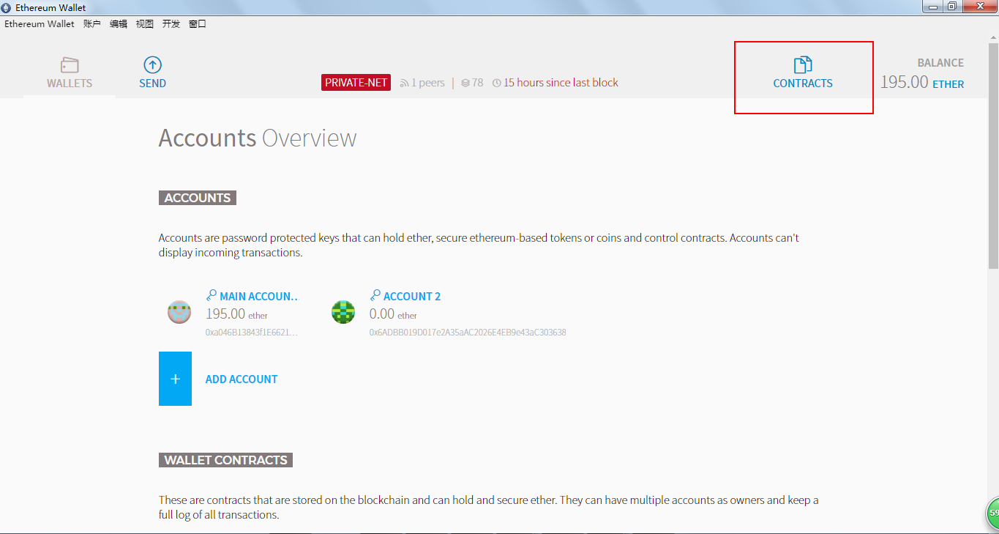

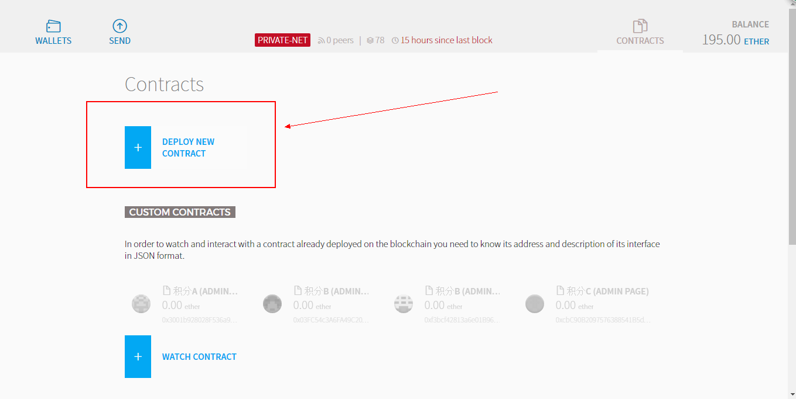

4.填写代币的相关信息

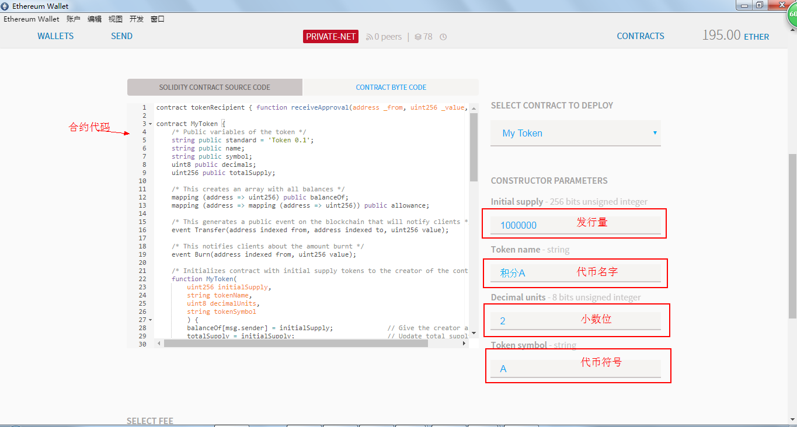

5.点击Deploy发现报错，"invalid argument 0 missing 0x prefix for hex data" 这是因为钱包和新版本的geth不匹配，x部署合约时，必须在十六进制前加0x可是这个版本的钱包没有加，所以部署不成功。要么改用旧版本的geth，要么还是使用在线编译合约。

6.如果以上问题无法解决，建议使用在线编译部署，和第五课的方法一致，不再赘述，直接贴部署代码，如下：
	
	var abi = [{"constant":true,"inputs":[],"name":"name","outputs":[{"name":"","type":"string"}],"payable":false,"type":"function"},{"constant":false,"inputs":[{"name":"_spender","type":"address"},{"name":"_value","type":"uint256"}],"name":"approve","outputs":[{"name":"success","type":"bool"}],"payable":false,"type":"function"},{"constant":true,"inputs":[],"name":"totalSupply","outputs":[{"name":"","type":"uint256"}],"payable":false,"type":"function"},{"constant":false,"inputs":[{"name":"_from","type":"address"},{"name":"_to","type":"address"},{"name":"_value","type":"uint256"}],"name":"transferFrom","outputs":[{"name":"success","type":"bool"}],"payable":false,"type":"function"},{"constant":true,"inputs":[],"name":"decimals","outputs":[{"name":"","type":"uint8"}],"payable":false,"type":"function"},{"constant":false,"inputs":[{"name":"_value","type":"uint256"}],"name":"burn","outputs":[{"name":"success","type":"bool"}],"payable":false,"type":"function"},{"constant":true,"inputs":[],"name":"standard","outputs":[{"name":"","type":"string"}],"payable":false,"type":"function"},{"constant":true,"inputs":[{"name":"","type":"address"}],"name":"balanceOf","outputs":[{"name":"","type":"uint256"}],"payable":false,"type":"function"},{"constant":false,"inputs":[{"name":"_from","type":"address"},{"name":"_value","type":"uint256"}],"name":"burnFrom","outputs":[{"name":"success","type":"bool"}],"payable":false,"type":"function"},{"constant":true,"inputs":[],"name":"symbol","outputs":[{"name":"","type":"string"}],"payable":false,"type":"function"},{"constant":false,"inputs":[{"name":"_to","type":"address"},{"name":"_value","type":"uint256"}],"name":"transfer","outputs":[],"payable":false,"type":"function"},{"constant":false,"inputs":[{"name":"_spender","type":"address"},{"name":"_value","type":"uint256"},{"name":"_extraData","type":"bytes"}],"name":"approveAndCall","outputs":[{"name":"success","type":"bool"}],"payable":false,"type":"function"},{"constant":true,"inputs":[{"name":"","type":"address"},{"name":"","type":"address"}],"name":"allowance","outputs":[{"name":"","type":"uint256"}],"payable":false,"type":"function"},{"inputs":[{"name":"initialSupply","type":"uint256"},{"name":"tokenName","type":"string"},{"name":"decimalUnits","type":"uint8"},{"name":"tokenSymbol","type":"string"}],"payable":false,"type":"constructor"},{"anonymous":false,"inputs":[{"indexed":true,"name":"from","type":"address"},{"indexed":true,"name":"to","type":"address"},{"indexed":false,"name":"value","type":"uint256"}],"name":"Transfer","type":"event"},{"anonymous":false,"inputs":[{"indexed":true,"name":"from","type":"address"},{"indexed":false,"name":"value","type":"uint256"}],"name":"Burn","type":"event"}]
	
	//以下是部署合约代码,
	var initialSupply = 1000000 ;
	var tokenName = "积分A" ;
	var decimalUnits = 2;
	var tokenSymbol = "A";
	var mytokenContract = web3.eth.contract([{"constant":true,"inputs":[],"name":"name","outputs":[{"name":"","type":"string"}],"payable":false,"type":"function"},{"constant":false,"inputs":[{"name":"_spender","type":"address"},{"name":"_value","type":"uint256"}],"name":"approve","outputs":[{"name":"success","type":"bool"}],"payable":false,"type":"function"},{"constant":true,"inputs":[],"name":"totalSupply","outputs":[{"name":"","type":"uint256"}],"payable":false,"type":"function"},{"constant":false,"inputs":[{"name":"_from","type":"address"},{"name":"_to","type":"address"},{"name":"_value","type":"uint256"}],"name":"transferFrom","outputs":[{"name":"success","type":"bool"}],"payable":false,"type":"function"},{"constant":true,"inputs":[],"name":"decimals","outputs":[{"name":"","type":"uint8"}],"payable":false,"type":"function"},{"constant":false,"inputs":[{"name":"_value","type":"uint256"}],"name":"burn","outputs":[{"name":"success","type":"bool"}],"payable":false,"type":"function"},{"constant":true,"inputs":[],"name":"standard","outputs":[{"name":"","type":"string"}],"payable":false,"type":"function"},{"constant":true,"inputs":[{"name":"","type":"address"}],"name":"balanceOf","outputs":[{"name":"","type":"uint256"}],"payable":false,"type":"function"},{"constant":false,"inputs":[{"name":"_from","type":"address"},{"name":"_value","type":"uint256"}],"name":"burnFrom","outputs":[{"name":"success","type":"bool"}],"payable":false,"type":"function"},{"constant":true,"inputs":[],"name":"symbol","outputs":[{"name":"","type":"string"}],"payable":false,"type":"function"},{"constant":false,"inputs":[{"name":"_to","type":"address"},{"name":"_value","type":"uint256"}],"name":"transfer","outputs":[],"payable":false,"type":"function"},{"constant":false,"inputs":[{"name":"_spender","type":"address"},{"name":"_value","type":"uint256"},{"name":"_extraData","type":"bytes"}],"name":"approveAndCall","outputs":[{"name":"success","type":"bool"}],"payable":false,"type":"function"},{"constant":true,"inputs":[{"name":"","type":"address"},{"name":"","type":"address"}],"name":"allowance","outputs":[{"name":"","type":"uint256"}],"payable":false,"type":"function"},{"inputs":[{"name":"initialSupply","type":"uint256"},{"name":"tokenName","type":"string"},{"name":"decimalUnits","type":"uint8"},{"name":"tokenSymbol","type":"string"}],"payable":false,"type":"constructor"},{"anonymous":false,"inputs":[{"indexed":true,"name":"from","type":"address"},{"indexed":true,"name":"to","type":"address"},{"indexed":false,"name":"value","type":"uint256"}],"name":"Transfer","type":"event"},{"anonymous":false,"inputs":[{"indexed":true,"name":"from","type":"address"},{"indexed":false,"name":"value","type":"uint256"}],"name":"Burn","type":"event"}]);
	var mytoken = mytokenContract.new(
	   initialSupply,
	   tokenName,
	   decimalUnits,
	   tokenSymbol,
	   {
	     from: web3.eth.accounts[0], 
	     data: '0x6060604052604060405190810160405280600981526020017f546f6b656e20302e31000000000000000000000000000000000000000000000081525060009080519060200190828054600181600116156101000203166002900490600052602060002090601f016020900481019282601f106200008857805160ff1916838001178555620000b9565b82800160010185558215620000b9579182015b82811115620000b85782518255916020019190600101906200009b565b5b509050620000e191905b80821115620000dd576000816000905550600101620000c3565b5090565b5050346200000057604051620014af380380620014af833981016040528080519060200190919080518201919060200180519060200190919080518201919050505b83600560003373ffffffffffffffffffffffffffffffffffffffff1673ffffffffffffffffffffffffffffffffffffffff16815260200190815260200160002081905550836004819055508260019080519060200190828054600181600116156101000203166002900490600052602060002090601f016020900481019282601f10620001bc57805160ff1916838001178555620001ed565b82800160010185558215620001ed579182015b82811115620001ec578251825591602001919060010190620001cf565b5b5090506200021591905b8082111562000211576000816000905550600101620001f7565b5090565b50508060029080519060200190828054600181600116156101000203166002900490600052602060002090601f016020900481019282601f106200026557805160ff191683800117855562000296565b8280016001018555821562000296579182015b828111156200029557825182559160200191906001019062000278565b5b509050620002be91905b80821115620002ba576000816000905550600101620002a0565b5090565b505081600360006101000a81548160ff021916908360ff1602179055505b505050505b6111be80620002f16000396000f300606060405236156100c3576000357c0100000000000000000000000000000000000000000000000000000000900463ffffffff16806306fdde03146100c8578063095ea7b31461015e57806318160ddd146101b257806323b872dd146101d5578063313ce5671461024857806342966c68146102715780635a3b7e42146102a657806370a082311461033c57806379cc67901461038357806395d89b41146103d7578063a9059cbb1461046d578063cae9ca51146104a9578063dd62ed3e14610540575b610000565b34610000576100d56105a6565b6040518080602001828103825283818151815260200191508051906020019080838360008314610124575b80518252602083111561012457602082019150602081019050602083039250610100565b505050905090810190601f1680156101505780820380516001836020036101000a031916815260200191505b509250505060405180910390f35b3461000057610198600480803573ffffffffffffffffffffffffffffffffffffffff16906020019091908035906020019091905050610644565b604051808215151515815260200191505060405180910390f35b34610000576101bf6106d2565b6040518082815260200191505060405180910390f35b346100005761022e600480803573ffffffffffffffffffffffffffffffffffffffff1690602001909190803573ffffffffffffffffffffffffffffffffffffffff169060200190919080359060200190919050506106d8565b604051808215151515815260200191505060405180910390f35b34610000576102556109f5565b604051808260ff1660ff16815260200191505060405180910390f35b346100005761028c6004808035906020019091905050610a08565b604051808215151515815260200191505060405180910390f35b34610000576102b3610b0b565b6040518080602001828103825283818151815260200191508051906020019080838360008314610302575b805182526020831115610302576020820191506020810190506020830392506102de565b505050905090810190601f16801561032e5780820380516001836020036101000a031916815260200191505b509250505060405180910390f35b346100005761036d600480803573ffffffffffffffffffffffffffffffffffffffff16906020019091905050610ba9565b6040518082815260200191505060405180910390f35b34610000576103bd600480803573ffffffffffffffffffffffffffffffffffffffff16906020019091908035906020019091905050610bc1565b604051808215151515815260200191505060405180910390f35b34610000576103e4610d4e565b6040518080602001828103825283818151815260200191508051906020019080838360008314610433575b8051825260208311156104335760208201915060208101905060208303925061040f565b505050905090810190601f16801561045f5780820380516001836020036101000a031916815260200191505b509250505060405180910390f35b34610000576104a7600480803573ffffffffffffffffffffffffffffffffffffffff16906020019091908035906020019091905050610dec565b005b3461000057610526600480803573ffffffffffffffffffffffffffffffffffffffff1690602001909190803590602001909190803590602001908201803590602001908080601f01602080910402602001604051908101604052809392919081815260200183838082843782019150505050505091905050610fed565b604051808215151515815260200191505060405180910390f35b3461000057610590600480803573ffffffffffffffffffffffffffffffffffffffff1690602001909190803573ffffffffffffffffffffffffffffffffffffffff1690602001909190505061116d565b6040518082815260200191505060405180910390f35b60018054600181600116156101000203166002900480601f01602080910402602001604051908101604052809291908181526020018280546001816001161561010002031660029004801561063c5780601f106106115761010080835404028352916020019161063c565b820191906000526020600020905b81548152906001019060200180831161061f57829003601f168201915b505050505081565b600081600660003373ffffffffffffffffffffffffffffffffffffffff1673ffffffffffffffffffffffffffffffffffffffff16815260200190815260200160002060008573ffffffffffffffffffffffffffffffffffffffff1673ffffffffffffffffffffffffffffffffffffffff16815260200190815260200160002081905550600190505b92915050565b60045481565b600060008373ffffffffffffffffffffffffffffffffffffffff1614156106fe57610000565b81600560008673ffffffffffffffffffffffffffffffffffffffff1673ffffffffffffffffffffffffffffffffffffffff16815260200190815260200160002054101561074a57610000565b600560008473ffffffffffffffffffffffffffffffffffffffff1673ffffffffffffffffffffffffffffffffffffffff1681526020019081526020016000205482600560008673ffffffffffffffffffffffffffffffffffffffff1673ffffffffffffffffffffffffffffffffffffffff168152602001908152602001600020540110156107d757610000565b600660008573ffffffffffffffffffffffffffffffffffffffff1673ffffffffffffffffffffffffffffffffffffffff16815260200190815260200160002060003373ffffffffffffffffffffffffffffffffffffffff1673ffffffffffffffffffffffffffffffffffffffff1681526020019081526020016000205482111561086057610000565b81600560008673ffffffffffffffffffffffffffffffffffffffff1673ffffffffffffffffffffffffffffffffffffffff1681526020019081526020016000206000828254039250508190555081600560008573ffffffffffffffffffffffffffffffffffffffff1673ffffffffffffffffffffffffffffffffffffffff1681526020019081526020016000206000828254019250508190555081600660008673ffffffffffffffffffffffffffffffffffffffff1673ffffffffffffffffffffffffffffffffffffffff16815260200190815260200160002060003373ffffffffffffffffffffffffffffffffffffffff1673ffffffffffffffffffffffffffffffffffffffff168152602001908152602001600020600082825403925050819055508273ffffffffffffffffffffffffffffffffffffffff168473ffffffffffffffffffffffffffffffffffffffff167fddf252ad1be2c89b69c2b068fc378daa952ba7f163c4a11628f55a4df523b3ef846040518082815260200191505060405180910390a3600190505b9392505050565b600360009054906101000a900460ff1681565b600081600560003373ffffffffffffffffffffffffffffffffffffffff1673ffffffffffffffffffffffffffffffffffffffff168152602001908152602001600020541015610a5657610000565b81600560003373ffffffffffffffffffffffffffffffffffffffff1673ffffffffffffffffffffffffffffffffffffffff16815260200190815260200160002060008282540392505081905550816004600082825403925050819055503373ffffffffffffffffffffffffffffffffffffffff167fcc16f5dbb4873280815c1ee09dbd06736cffcc184412cf7a71a0fdb75d397ca5836040518082815260200191505060405180910390a2600190505b919050565b60008054600181600116156101000203166002900480601f016020809104026020016040519081016040528092919081815260200182805460018160011615610100020316600290048015610ba15780601f10610b7657610100808354040283529160200191610ba1565b820191906000526020600020905b815481529060010190602001808311610b8457829003601f168201915b505050505081565b60056020528060005260406000206000915090505481565b600081600560008573ffffffffffffffffffffffffffffffffffffffff1673ffffffffffffffffffffffffffffffffffffffff168152602001908152602001600020541015610c0f57610000565b600660008473ffffffffffffffffffffffffffffffffffffffff1673ffffffffffffffffffffffffffffffffffffffff16815260200190815260200160002060003373ffffffffffffffffffffffffffffffffffffffff1673ffffffffffffffffffffffffffffffffffffffff16815260200190815260200160002054821115610c9857610000565b81600560008573ffffffffffffffffffffffffffffffffffffffff1673ffffffffffffffffffffffffffffffffffffffff16815260200190815260200160002060008282540392505081905550816004600082825403925050819055508273ffffffffffffffffffffffffffffffffffffffff167fcc16f5dbb4873280815c1ee09dbd06736cffcc184412cf7a71a0fdb75d397ca5836040518082815260200191505060405180910390a2600190505b92915050565b60028054600181600116156101000203166002900480601f016020809104026020016040519081016040528092919081815260200182805460018160011615610100020316600290048015610de45780601f10610db957610100808354040283529160200191610de4565b820191906000526020600020905b815481529060010190602001808311610dc757829003601f168201915b505050505081565b60008273ffffffffffffffffffffffffffffffffffffffff161415610e1057610000565b80600560003373ffffffffffffffffffffffffffffffffffffffff1673ffffffffffffffffffffffffffffffffffffffff168152602001908152602001600020541015610e5c57610000565b600560008373ffffffffffffffffffffffffffffffffffffffff1673ffffffffffffffffffffffffffffffffffffffff1681526020019081526020016000205481600560008573ffffffffffffffffffffffffffffffffffffffff1673ffffffffffffffffffffffffffffffffffffffff16815260200190815260200160002054011015610ee957610000565b80600560003373ffffffffffffffffffffffffffffffffffffffff1673ffffffffffffffffffffffffffffffffffffffff1681526020019081526020016000206000828254039250508190555080600560008473ffffffffffffffffffffffffffffffffffffffff1673ffffffffffffffffffffffffffffffffffffffff168152602001908152602001600020600082825401925050819055508173ffffffffffffffffffffffffffffffffffffffff163373ffffffffffffffffffffffffffffffffffffffff167fddf252ad1be2c89b69c2b068fc378daa952ba7f163c4a11628f55a4df523b3ef836040518082815260200191505060405180910390a35b5050565b60006000849050610ffe8585610644565b15611164578073ffffffffffffffffffffffffffffffffffffffff16638f4ffcb1338630876040518563ffffffff167c0100000000000000000000000000000000000000000000000000000000028152600401808573ffffffffffffffffffffffffffffffffffffffff1673ffffffffffffffffffffffffffffffffffffffff1681526020018481526020018373ffffffffffffffffffffffffffffffffffffffff1673ffffffffffffffffffffffffffffffffffffffff16815260200180602001828103825283818151815260200191508051906020019080838360008314611107575b805182526020831115611107576020820191506020810190506020830392506110e3565b505050905090810190601f1680156111335780820380516001836020036101000a031916815260200191505b5095505050505050600060405180830381600087803b156100005760325a03f1156100005750505060019150611165565b5b509392505050565b60066020528160005260406000206020528060005260406000206000915091505054815600a165627a7a7230582006faf5c01736c3f60a767ba689acb48a4d312b853a2c7c7e6977bce092db41780029', 
	     gas: '4700000'
	   }, function (e, contract){
	    console.log(e, contract);
	    if (typeof contract.address !== 'undefined') {
	         console.log('Contract mined! address: ' + contract.address + ' transactionHash: ' + contract.transactionHash);
	    }
	 })

	//返回的结果为：
	address: 0xec2f2bcf3122700e575b387038635e4910177827  //智能合约地址
	transactionHash: 0xfe8f8e1017860ecf560a91b69c328075cdb9c5c6d85299f7709ad96b6751daf9 //交易hash

7.查看在控制台部署的智能合约

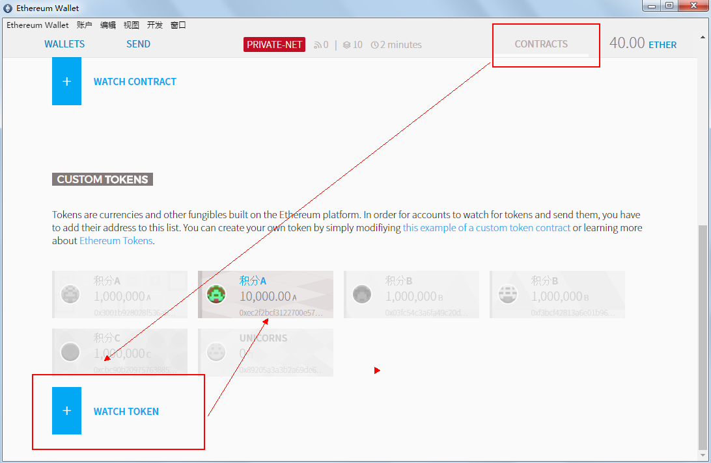

8.添写智能合约地址，会显示积分A的详细信息

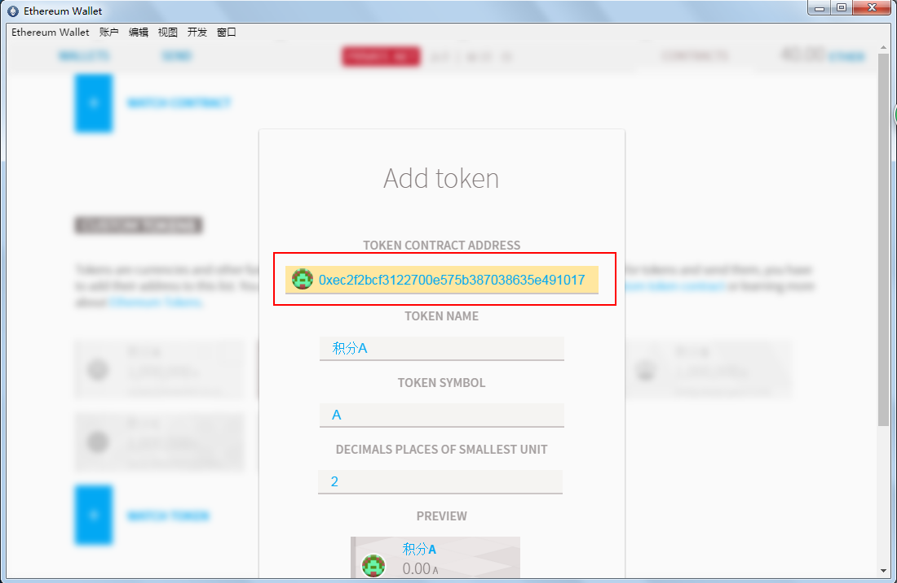

9.然后再看一下主账户

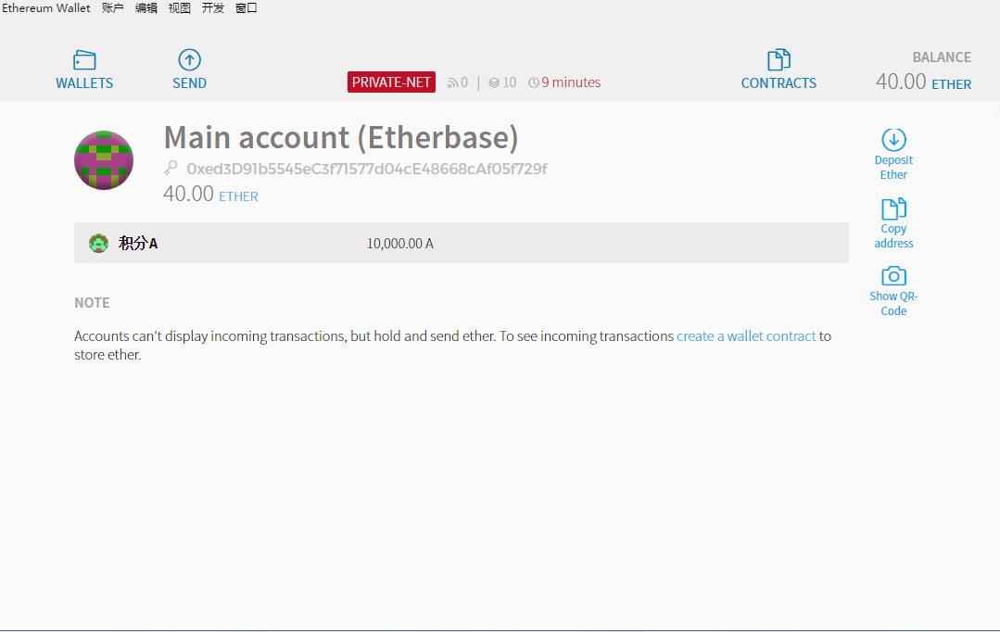

10.使用相同的方法添加积分B,积分C,以下是返回结果，一定要换成自己链上的合约地址，这些信息后面还要结合abi一起获得合约实例，来操作这些代币积分。

	//积分B
	address: 0xff9239d924d5b7e023a974fe1472793b63528ed2 
	transactionHash: 0xefc67d722559011cfdfaf213dc09a29de7eb158fd863e72fa0d31431420913b1
	//积分C
	address: 0x7fd7bf87b749ba74ecd70076fa24b7c3481cc2e0 transactionHash:0xa06bd70e89c64211987cd03342d0f62c70c09606e79b6ab9dbc03a86cc24714d

11.全部成功后再查询一下，就可以看到主账户上有三个积分。10000.00 积分A,可以看出总量1000000，小数为2，得到的最终数据是10000.00保留两位小数的1万积分A。

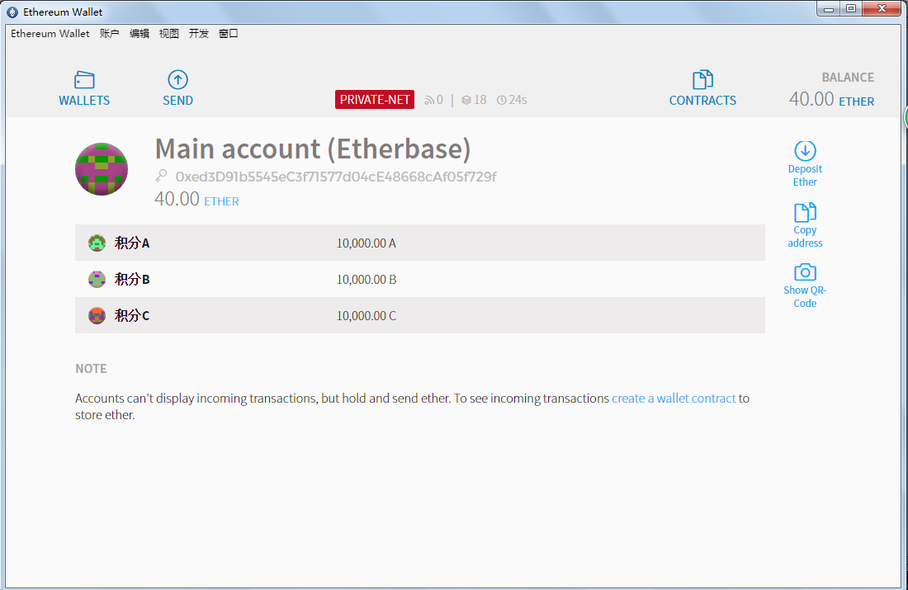

12.使用钱包给账户2转入以太币，积分A、B、C。下图表示4笔交易正在进行，需要12个区块确认才能被真正打包到区块中。

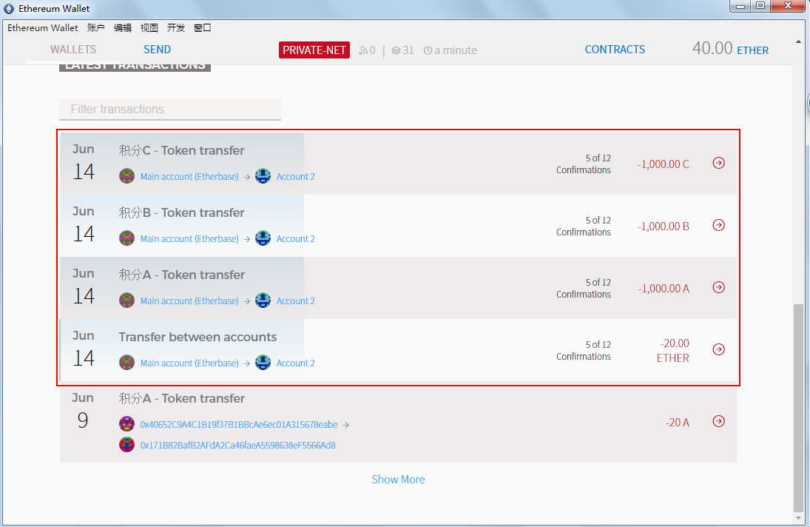

13.打包完成后就，查看两个账户

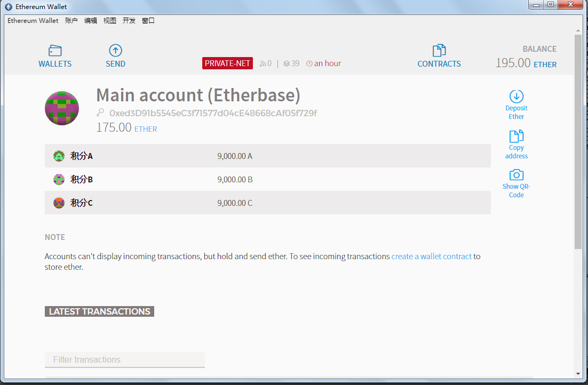
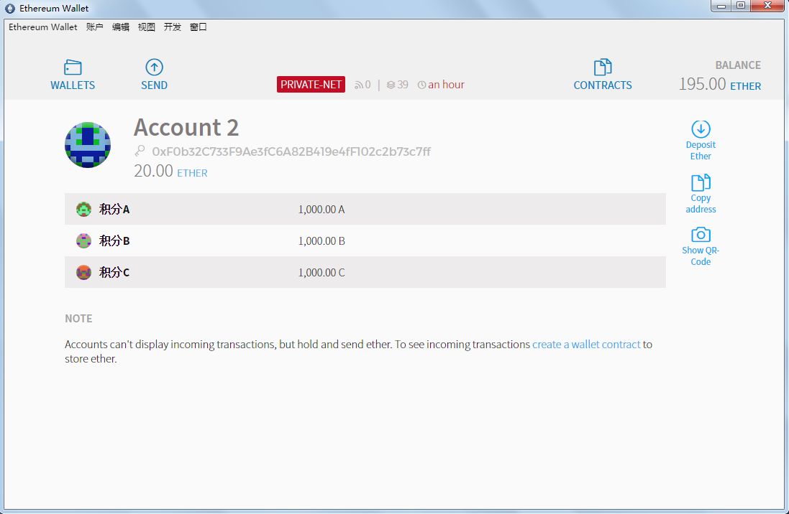
##三、积分交易的应用开发
现在准备工作基本已经做完了，现在开始写功能和页面。对于页面布局和样式就不赘述了，只讲解跟以太坊有关的路由和页面的js的ajax的部分。
###1.积分帐号的余额显示
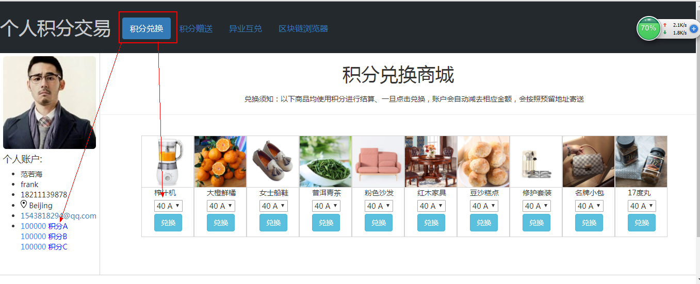
这个功能很简单，只需要在路由中添加积分abi和address。调用合约的余额方法。

	mapping (address => uint256) public balanceOf;
上一行代码定义了一个字典，相当于一个map，key是address，value是uint256类型的数据balanceOf。定义成了public说明这个变量也是一个自生方法，可以直接调用获得指定地址的代币余额。修改路由文件routes/index.js:
	
	vvar express = require('express')
	var router = express.Router()
	var Web3 = require('web3')
	var web3 = new Web3()
	web3.setProvider(new web3.providers.HttpProvider('http://localhost:8545'))
	var abi = [ { "constant": true, "inputs": [], "name": "name", "outputs": [ { "name": "", "type": "string", "value": "" } ], "type": "function" }, { "constant": false, "inputs": [ { "name": "_spender", "type": "address" }, { "name": "_value", "type": "uint256" } ], "name": "approve", "outputs": [ { "name": "success", "type": "bool" } ], "type": "function" }, { "constant": true, "inputs": [], "name": "totalSupply", "outputs": [ { "name": "", "type": "uint256", "value": "1000000" } ], "type": "function" }, { "constant": false, "inputs": [ { "name": "_from", "type": "address" }, { "name": "_to", "type": "address" }, { "name": "_value", "type": "uint256" } ], "name": "transferFrom", "outputs": [ { "name": "success", "type": "bool" } ], "type": "function" }, { "constant": true, "inputs": [], "name": "decimals", "outputs": [ { "name": "", "type": "uint8", "value": "0" } ], "type": "function" }, { "constant": false, "inputs": [ { "name": "_value", "type": "uint256" } ], "name": "burn", "outputs": [ { "name": "success", "type": "bool" } ], "type": "function" }, { "constant": true, "inputs": [], "name": "standard", "outputs": [ { "name": "", "type": "string", "value": "Token 0.1" } ], "type": "function" }, { "constant": true, "inputs": [ { "name": "", "type": "address" } ], "name": "balanceOf", "outputs": [ { "name": "", "type": "uint256", "value": "0" } ], "type": "function" }, { "constant": false, "inputs": [ { "name": "_from", "type": "address" }, { "name": "_value", "type": "uint256" } ], "name": "burnFrom", "outputs": [ { "name": "success", "type": "bool" } ], "type": "function" }, { "constant": true, "inputs": [], "name": "symbol", "outputs": [ { "name": "", "type": "string", "value": "A" } ], "type": "function" }, { "constant": false, "inputs": [ { "name": "_to", "type": "address" }, { "name": "_value", "type": "uint256" } ], "name": "transfer", "outputs": [], "type": "function" }, { "constant": false, "inputs": [ { "name": "_spender", "type": "address" }, { "name": "_value", "type": "uint256" }, { "name": "_extraData", "type": "bytes" } ], "name": "approveAndCall", "outputs": [ { "name": "success", "type": "bool" } ], "type": "function" }, { "constant": true, "inputs": [ { "name": "", "type": "address" }, { "name": "", "type": "address" } ], "name": "allowance", "outputs": [ { "name": "", "type": "uint256", "value": "0" } ], "type": "function" }, { "inputs": [ { "name": "initialSupply", "type": "uint256", "index": 0, "typeShort": "uint", "bits": "256", "displayName": "initial Supply", "template": "elements_input_uint", "value": "1000000" }, { "name": "tokenName", "type": "string", "index": 1, "typeShort": "string", "bits": "", "displayName": "token Name", "template": "elements_input_string", "value": "积分A" }, { "name": "decimalUnits", "type": "uint8", "index": 2, "typeShort": "uint", "bits": "8", "displayName": "decimal Units", "template": "elements_input_uint", "value": "0" }, { "name": "tokenSymbol", "type": "string", "index": 3, "typeShort": "string", "bits": "", "displayName": "token Symbol", "template": "elements_input_string", "value": "A" } ], "type": "constructor" }, { "anonymous": false, "inputs": [ { "indexed": true, "name": "from", "type": "address" }, { "indexed": true, "name": "to", "type": "address" }, { "indexed": false, "name": "value", "type": "uint256" } ], "name": "Transfer", "type": "event" }, { "anonymous": false, "inputs": [ { "indexed": true, "name": "from", "type": "address" }, { "indexed": false, "name": "value", "type": "uint256" } ], "name": "Burn", "type": "event" } ]
	//积分A
	var aAddress = "0xec2f2bcf3122700e575b387038635e4910177827"
	var a = web3.eth.contract(abi).at(aAddress);
	//积分B
	var bAddress = "0xff9239d924d5b7e023a974fe1472793b63528ed2"
	var b = web3.eth.contract(abi).at(bAddress);
	//积分C
	var cAddress = "0x7fd7bf87b749ba74ecd70076fa24b7c3481cc2e0"
	var c = web3.eth.contract(abi).at(cAddress);
	//获取账户积分余额
	var aBalance = a.balanceOf(web3.eth.accounts[1]);
	var bBalance = b.balanceOf(web3.eth.accounts[1]);
	var cBalance = c.balanceOf(web3.eth.accounts[1]);
	//获得积分兑换页面时，将三个余额传给页面
	router.get('/index', function(req, res, next) {
	   res.render('index'，{"aBalance":aBalance,"bBalance":bBalance,"cBalance":cBalance})
	})

在页面中我们也是只需要利用ejs模版引擎的语法<%= %>将三个变量展现在页面。

	<li>
	  <%=aBalance%>&nbsp;积分A 
	  <%=bBalance%>&nbsp;积分B 
	  <%=cBalance%>&nbsp;积分C 
    </li>

###1.积分兑换商品
这些商品的图片是从百度里连接过来的，价格是随意定了，用三种价格定价，例如第一个是，榨汁机，兑换价格40A,50B,60C。这里没有考虑ABC三种代币的兑换比例，思路就是这里点击兑换，本账户就会把代币积分转账给主账户，用到合约中的transfer方法。先修改views/index.html文件：
	
	

在routes/index.js上添加处理，将传进来的字符串，分为数字和标识，如40A分为40和A,通过标识判断用哪个代币合约，然后调用其中的transfer函数。

	router.post('/buy',function(req,res,next){
	var account1 = web3.eth.accounts[0];
	var account2 = web3.eth.accounts[1];
	var sage = req.body.sage;
	var arr = sage.split(" ");
	var amount = parseInt(arr[0]);
	var sort = arr[1];
	var hash = "";
	console.log(account1,account2,sage,arr,amount,sort,hash);
	switch (sort){
		case "A" :
			hash = a.transfer(account1,amount,{from:account2});
			break;
	    case "B" :
			hash = b.transfer(account1,amount,{from:account2});
			break;
		case "C" :
			hash = c.transfer(account1,amount,{from:account2});
			break;
		default:
			console.log("nothing");
			break;
		}
		console.log(hash);
    res.send({hash:hash});
	})
###2.积分赠送
这个页面核心功能就是一个转账功能，调用合约的transfer。
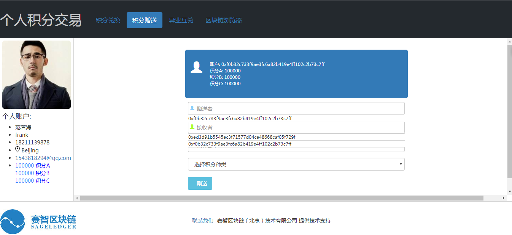
1.显示账户和余额，在返回此页面时一起带到页面。
	
	router.get('/trans', function(req, res, next) {
	var account = web3.eth.accounts[1];
	var accounts = web3.eth.accounts;
	console.log(accounts)
	  res.render('trans',{"account":account,"accounts":accounts,"aBalance":aBalance,"bBalance":bBalance,"cBalance":cBalance})
	})

2.页面显示这些信息很简单

	
账户:&nbsp;<%-account%>

	
积分A:&nbsp;<%-aBalance%> 

	
积分B:&nbsp;<%-bBalance%> 

	
积分C:&nbsp;<%-cBalance%> 

3.赠送者，就是本地帐号，接收者为其他的帐号，选择积分种类后，点击赠送，发送一个ajax异步请求，将这三个数据传到后台，然后根据不同种类代币选择合约来处理赠送操作。

	router.post("/send",function(req,res,next){
	var account1 = req.body.account1;
	var account2 = req.body.account2;
	var amount = req.body.amount;
	var sort = req.body.sort;
	var hash = "";
	console.log(account1,account2,sage,arr,amount,sort,hash);
	switch (sort){
		case "A" :
			hash = a.transfer(account1,amount,{from:account2});
			break;
	    case "B" :
			hash = b.transfer(account1,amount,{from:account2});
			break;
		case "C" :
			hash = c.transfer(account1,amount,{from:account2});
			break;
		default:
			console.log("nothing");
			break;
		}
		console.log(hash);
        res.send({hash:hash});
	})

###3.异业互兑
就是根据当前代币价格进行代币之间的兑换，所以得有一个实时的价格走势，所以左边弄了一个走势图（数据均是虚构的），这个是用echarts做的，前面已经让下载准备好了。
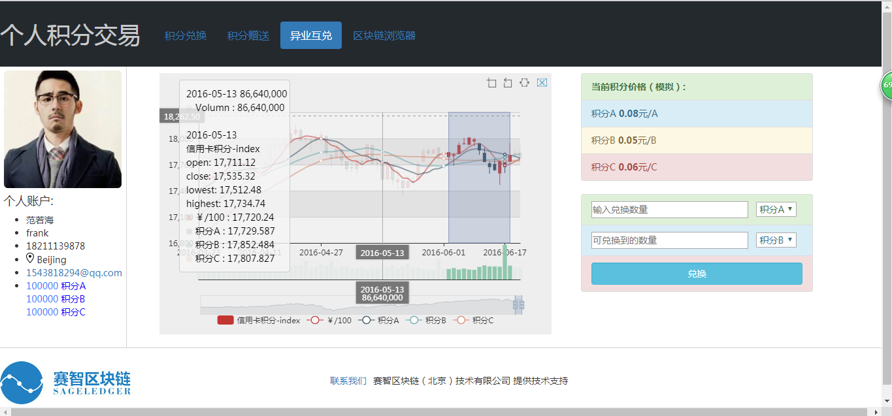
1.左边的走势图，首先在页面引用echarts.min.js文件。

	//引用echarts.min.js文件
	
	//走势图的具体文件，具体代码在源码中查看
	

在lines.js中有一句代码是从后台获取数据的。

	$.get('/dataJson').done(function (rawData) {
	.........
	........
	}

在后台我们把数据写在一个json对象中，提供给这个走势图。

	router.get('/dataJson',function(req,res,next){
		var dataJson = [["2004-01-02",10452.74,10409.85,10367.41,10554.96,168890000],["2004-01-05",10411.85,10544.07,10411.85,10575.92,221290000],["2004-01-06",1054 
		...........
		...........
		["2016-06-21",17827.33,17829.73,17799.8,17877.84,85130000],["2016-06-22",17832.67,17780.83,17770.36,17920.16,89440000]]
		res.send(dataJson);
	})

2.右上方的价格（与人民币兑换的价格）是虚构的。但是下面的兑换很简单，只是选择不同币种，然后根据上方的价格比例进行互相兑换，置于交互效果什么的就不赘述了。
首先是在页面写异步请求，将选择的币种，兑换的量传给后台，进行处理：

	

然后后台根据传来的参数再进行判断，进行兑换，就是在这个过程中忽略收取手续费等，假设A兑换B,则后台会先将A转账给主账户，主账户会按照比例转相应比例的B给本地账户，这样就做到了积分兑换。
	
	router.post("/ex",function(req,res,next){
	var account1 = web3.eth.accounts[0];
	var account2 = web3.eth.accounts[1];
	var s1 = req.body.s1;
	var s2 = req.body.s2;
	var rateA = req.body.rateA;
	var rateB = req.body.rateB;
	var rateC = req.body.rateC;
	var n1 = req.body.n1;
	var n2 = req.body.n2;
	switch(s1){
		case "A":
			switch(s2){
				case "A":
					console.log("相同积分无需兑换");
					break;
				case "B":
					n2 = n1*rateA/rateB;
					n2 = parseInt(n2);
					a.transfer(account1,n1,{from:account2});
					b.transfer(account2,n2,{from:account1});
					break;
				case "C":
					n2 = n1*rateA/rateC;
					n2 = parseInt(n2);
					a.transfer(account1,n1,{from:account2});
					c.transfer(account2,n2,{from:account1});
					break;
				default:
					break;
			}
			break;
		case "B":
			switch(s2){
					case "A":
						n2 = n1*rateB/rateA;
						n2 = parseInt(n2);
						b.transfer(account1,n1,{from:account2});
					    a.transfer(account2,n2,{from:account1});
						break;
					case "B":
						console.log("相同积分无需兑换");
						break;
					case "C":
						n2 = n1*rateB/rateC;
						n2 = parseInt(n2);
						b.transfer(account1,n1,{from:account2});
					    c.transfer(account2,n2,{from:account1});
						break;
					default:
						break;
			}
			break;
		case "C":
			switch(s2){

					case "A":
						n2 = n1*rateC/rateA;
						n2 = parseInt(n2);
						c.transfer(account1,n1,{from:account2});
					    a.transfer(account2,n2,{from:account1});
						break;
					case "B":
						n2 = n1*rateC/rateB;
						n2 = parseInt(n2);
						c.transfer(account1,n1,{from:account2});
					    b.transfer(account2,n2,{from:account1});
						break;
					case "C":
						console.log("相同积分无需兑换");
					default:
						break;
			}
			break;
		default:
			break;
	}

    res.send({s1:s1,n2:n2});
	})

###4.简易浏览器
简易浏览器的实现，这里做一个示范，后期可以自行扩展，主要方法就是通过web3获得最近的一批区块信息，然后通过查看区块是否有交易，有交易点击区块hash就可以查看本区块上打包的交易了。
下面的代码是，浏览器页面区块信息表给，使用了forEach()循环语句，将数组遍历，然后展示出来。
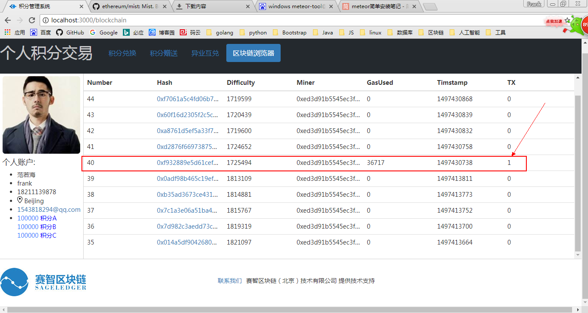

	

			<table class="table">
			  <caption style="font-size: 20px">&nbsp;&nbsp;区块信息 共<%-blockNumber%>块</caption>
			  <thead>
			    <tr>
			      <th>Number</th>
			      <th>Hash</th>
			      <th>Difficulty</th>
			      <th>Miner</th>
			      <th>GasUsed</th>
			      <th>Timstamp</th>
			      <th>TX</th>
			    </tr>
			  </thead>
			  <tbody>
			    <%blocksInfo.forEach(function(blockInfo){%>
					<tr>
				      <td><%-blockInfo.number%></td>
				      <td><a href="/transInfo?hash=<%-blockInfo.hash%>"><%-blockInfo.hash%></a></td>
				      <td><%-blockInfo.difficulty%></td>
				      <td><%-blockInfo.miner%></td>
				      <td><%-blockInfo.gasUsed%></td>
				      <td><%-blockInfo.timestamp%></td>
				      <td><%-blockInfo.transactions.length%></td>
				    </tr>
			    <%})%> 
			  </tbody>
			</table>
		

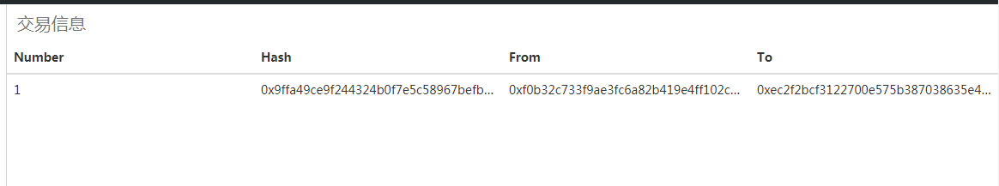

实现以上界面效果的后台代码其实也只有几行：

	router.get('/blockchain', function(req, res, next) {
		var blockNumber = web3.eth.blockNumber
		var blocksInfo = new Array()
	        var index = 0
	        for(var i= blockNumber;i>blockNumber-10;i--){
	            blocksInfo[index] = web3.eth.getBlock(i)
	            index++
	        }
	  res.render('blockchain',{"blocksInfo":blocksInfo,"blockNumber":blockNumber,"aBalance":aBalance,"bBalance":bBalance,"cBalance":cBalance})
	})

这里只展示了交易的三个信息，hash值，发送者，接收者。每笔交易中包含很多数据，可以依依罗列出来。

	

			<table class="table">
			  <caption style="font-size: 20px">&nbsp;&nbsp;交易信息</caption>
				  <thead>
				    <tr>
				      <th>Number</th>
				      <th>Hash</th>
				      <th>From</th>
				      <th>To</th>
				    </tr>
				  </thead>
				  <tbody>
				  <%var i = 0 %>
				  <%transactionsInfo.forEach(function(transactionInfo){%>
				  <%i++%>
					<tr>
				      <td><%=i%></td>
				      <td><%-transactionInfo.hash%></td>
				      <td><%-transactionInfo.from%></td>
				      <td><%-transactionInfo.to%></td>
				      
				    </tr>
			    <%})%> 
				  </tbody>
			</table>
		

实现展示交易的页面效果的代码为：

	router.get("/transInfo",function(req,res,next){
	var hash = req.query.hash;
	console.log(hash);
	var transactions = web3.eth.getBlock(hash).transactions;
	var transactionsInfo = [];
	for(var i=0;i<transactions.length;i++){
		var hash = transactions[i];
		transactionsInfo[i] = web3.eth.getTransaction(hash);
	}
	console.log(transactionsInfo);
	res.render("transInfo",{"transactionsInfo":transactionsInfo,"aBalance":aBalance,"bBalance":bBalance,"cBalance":cBalance})
	})

在控制台获取某个交易的全部信息的步骤是，先通过块高获得该区块信息，可以在tansactions中看到一个交易hash数组，然后通过数组下标获得想要查看的交易信息：

 	 
    命令1：eth.getBlock(40)
	{
	  difficulty: 1725494,
	  extraData: "0xd983010600846765746887676f312e382e318777696e646f7773",
	  gasLimit: 45205024,
	  gasUsed: 36717,
	  hash: "0xf932889e5d61cefcc4c89491291f5ac9f0bcfb252264a1dbfcd084fa693ef43a",
	  logsBloom: "0x000000000000000000000000000000000000000000000000100000000000800000000000000000400000
	0000000000000000000000000000000000000000000000000000000000000000000800000000000000000000000000000000
	0000000000000000000000000000000000000200000000000800000000000010040000000000000000000000000000000000
	0000000000000000000000000000020000000000000000000000000000000000000000000000000020000000000000000000
	0000000200000000000000000000000000000000000000000000000000000000000000000000000000000000000000000000
	0000000000002000000000000000",
	  miner: "0xed3d91b5545ec3f71577d04ce48668caf05f729f",
	  mixHash: "0xf86b401f76f9b0d759e3f0cf1569eddeebe2f1bc97b86e27494eb90c8b06a547",
	  nonce: "0x336d33d6486c3ae6",
	  number: 40,
	  parentHash: "0x0adf98b465c19efe6199017c157494b92694868ebd18d47581eda441f8211b26",
	  receiptsRoot: "0x7bf009cee2640bdb6af210c879b78db60220395680a565927d8b19b6380e0815",
	  sha3Uncles: "0x1dcc4de8dec75d7aab85b567b6ccd41ad312451b948a7413f0a142fd40d49347",
	  size: 715,
	  stateRoot: "0xd310759cf9de8163f9b19ea081e2e433b76d1d4702a56a4e7a4e94169ca2addc",
	  timestamp: 1497430738,
	  totalDifficulty: 77526996,
	  transactions: ["0x9ffa49ce9f244324b0f7e5c58967befb621569889af68d53a031e10140e7cfe6"],
	  transactionsRoot: "0xb1a126b696cf52d5a968b814d0fd3170e7883d2e64efd5b6eb80c0abc49f7cd3",
	  uncles: []
	}

	命令2：var hash = eth.getBlock(40).transactions[0]
	undefined
	命令3：hash
	"0x9ffa49ce9f244324b0f7e5c58967befb621569889af68d53a031e10140e7cfe6"
	命令4：eth.getTransaction(hash)
	{
	  blockHash: "0xf932889e5d61cefcc4c89491291f5ac9f0bcfb252264a1dbfcd084fa693ef43a",
	  blockNumber: 40,
	  from: "0xf0b32c733f9ae3fc6a82b419e4ff102c2b73c7ff",
	  gas: 90000,
	  gasPrice: 20000000000,
	  hash: "0x9ffa49ce9f244324b0f7e5c58967befb621569889af68d53a031e10140e7cfe6",
	  input: "0xa9059cbb000000000000000000000000ed3d91b5545ec3f71577d04ce48668caf05f729f0000000000000000
	000000000000000000000000000000000000000000000028",
	  nonce: 0,
	  r: "0x7f73237dbd09791635ef30f6d9dff0fa18c3ffd389d46fec402de01032c9fee0",
	  s: "0x6c159fadbbabd947de1b79523f89622c9402ea72231c4b68d1c2df75b0ee62d0",
	  to: "0xec2f2bcf3122700e575b387038635e4910177827",
	  transactionIndex: 0,
	  v: "0x32eb",
	  value: 0
	}

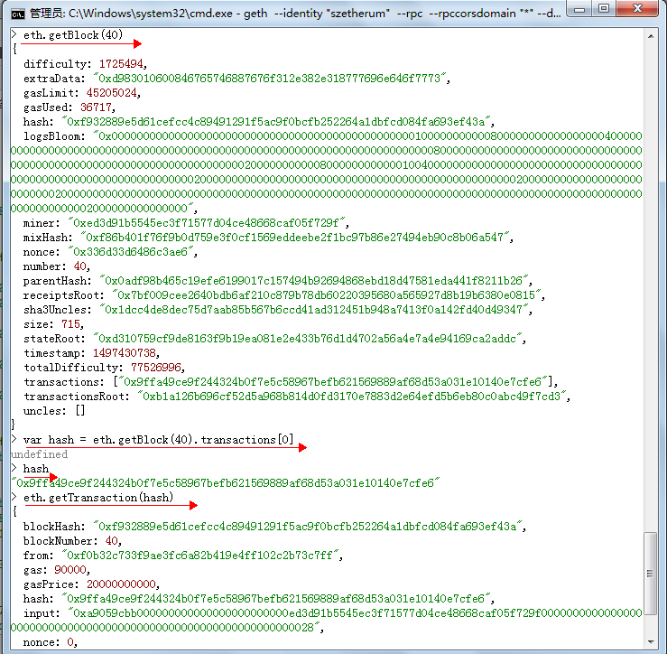