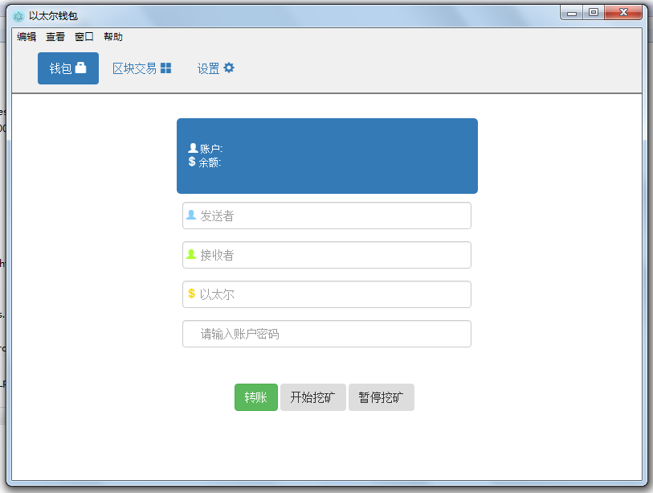
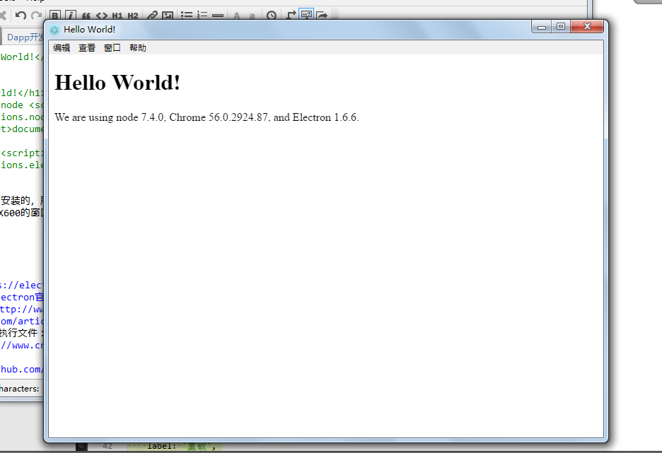
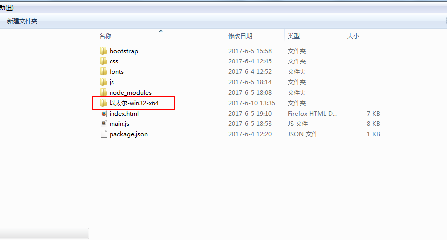
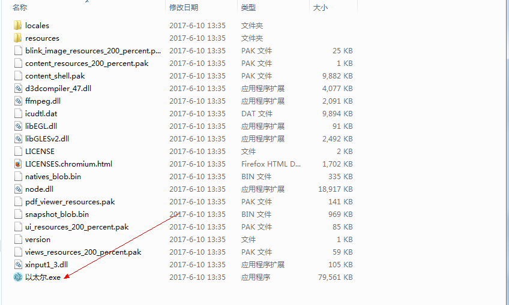

#以太尔简易钱包开发#

这节课跟大家分享一个有趣的东西，以太坊官方钱包真的很复杂，不过用到的技术大致就三个，Electron:一个可以使用js,css,html制作桌面应用的js框架。Meteor：一个可以实时显示的框架。剩下的就是Ethereum:包含以太坊的web3.js技术。使用这些就可以完成以太坊官方钱包。由于本人js的技术太差，没有学习Meteor。也没有深究Electron,这里就直接用Electron和Ethereum的最基本的知识做一个钱包转账的功能。会把源码直接贴到这个文件中，也会把源码和打包后的程序放到这个文件夹中。再看一下最终效果。

##一、开发环境搭建##

###1.下载软件###

下载并安装electron软件包：
	
	npm install -g electron
	npm install -g electron-packager

如果国外镜像下载不了，可以更换为淘宝的镜像

	npm install -g cnpm –registry=https://registry.npm.taobao.org
	//安装完以后就可以使用cnpm命令了
	cnpm install -g electron
	cnpm install -g electron-packager

##二、测试软件##

###1.编写测试文件###

1.新建一个项目，命名为app，并新建三个必要文件。
	
	app/ 
	├── package.json 
	├── main.js 
	└── index.html
 package.json的内容:

	{
	  "name"    : "app",
	  "version" : "0.1.0",
	  "main"    : "main.js"
	}
main.js的内容
	
	/**
	 * Created by apple on 16/6/3.
	 */
	const electron = require('electron');
	// 用于控制应用生命周期
	const {app} = electron;
	// 用于创建本地窗口
	const {BrowserWindow} = electron;
	const Menu = electron.Menu;
	let template = [{
	  label: '编辑',
	  submenu: [{
	    label: '撤销',
	    accelerator: 'CmdOrCtrl+Z',
	    role: 'undo'
	  }, {
	    label: '重做',
	    accelerator: 'Shift+CmdOrCtrl+Z',
	    role: 'redo'
	  }, {
	    type: 'separator'
	  }, {
	    label: '剪切',
	    accelerator: 'CmdOrCtrl+X',
	    role: 'cut'
	  }, {
	    label: '复制',
	    accelerator: 'CmdOrCtrl+C',
	    role: 'copy'
	  }, {
	    label: '粘贴',
	    accelerator: 'CmdOrCtrl+V',
	    role: 'paste'
	  }, {
	    label: '全选',
	    accelerator: 'CmdOrCtrl+A',
	    role: 'selectall'
	  }]
	}, {
	  label: '查看',
	  submenu: [{
	    label: '重载',
	    accelerator: 'CmdOrCtrl+R',
	    click: function (item, focusedWindow) {
	      if (focusedWindow) {
	        // 重载之后, 刷新并关闭所有的次要窗体
	        if (focusedWindow.id === 1) {
	          BrowserWindow.getAllWindows().forEach(function (win) {
	            if (win.id > 1) {
	              win.close()
	            }
	          })
	        }
	        focusedWindow.reload()
	      }
	    }
	  }, {
	    label: '切换全屏',
	    accelerator: (function () {
	      if (process.platform === 'darwin') {
	        return 'Ctrl+Command+F'
	      } else {
	        return 'F11'
	      }
	    })(),
	    click: function (item, focusedWindow) {
	      if (focusedWindow) {
	        focusedWindow.setFullScreen(!focusedWindow.isFullScreen())
	      }
	    }
	  }, {
	    label: '切换开发者工具',
	    accelerator: (function () {
	      if (process.platform === 'darwin') {
	        return 'Alt+Command+I'
	      } else {
	        return 'Ctrl+Shift+I'
	      }
	    })(),
	    click: function (item, focusedWindow) {
	      if (focusedWindow) {
	        focusedWindow.toggleDevTools()
	      }
	    }
	  }, {
	    type: 'separator'
	  }, {
	    label: '应用程序菜单演示',
	    click: function (item, focusedWindow) {
	      if (focusedWindow) {
	        const options = {
	          type: 'info',
	          title: '应用程序菜单演示',
	          buttons: ['好的'],
	          message: '此演示用于 "菜单" 部分, 展示如何在应用程序菜单中创建可点击的菜单项.'
	        }
	        electron.dialog.showMessageBox(focusedWindow, options, function () {})
	      }
	    }
	  }]
	}, {
	  label: '窗口',
	  role: 'window',
	  submenu: [{
	    label: '最小化',
	    accelerator: 'CmdOrCtrl+M',
	    role: 'minimize'
	  }, {
	    label: '关闭',
	    accelerator: 'CmdOrCtrl+W',
	    role: 'close'
	  }, {
	    type: 'separator'
	  }, {
	    label: '重新打开窗口',
	    accelerator: 'CmdOrCtrl+Shift+T',
	    enabled: false,
	    key: 'reopenMenuItem',
	    click: function () {
	      app.emit('activate')
	    }
	  }]
	}, {
	  label: '帮助',
	  role: 'help',
	  submenu: [{
	    label: '学习更多',
	    click: function () {
	      electron.shell.openExternal('https://www.baidu.com')
	    }
	  }]
	}]
	
	function addUpdateMenuItems (items, position) {
	  if (process.mas) return
	
	  const version = electron.app.getVersion()
	  let updateItems = [{
	    label: `Version ${version}`,
	    enabled: false
	  }, {
	    label: '正在检查更新',
	    enabled: false,
	    key: 'checkingForUpdate'
	  }, {
	    label: '检查更新',
	    visible: false,
	    key: 'checkForUpdate',
	    click: function () {
	      require('electron').autoUpdater.checkForUpdates()
	    }
	  }, {
	    label: '重启并安装更新',
	    enabled: true,
	    visible: false,
	    key: 'restartToUpdate',
	    click: function () {
	      require('electron').autoUpdater.quitAndInstall()
	    }
	  }]
	
	  items.splice.apply(items, [position, 0].concat(updateItems))
	}
	
	function findReopenMenuItem () {
	  const menu = Menu.getApplicationMenu()
	  if (!menu) return
	
	  let reopenMenuItem
	  menu.items.forEach(function (item) {
	    if (item.submenu) {
	      item.submenu.items.forEach(function (item) {
	        if (item.key === 'reopenMenuItem') {
	          reopenMenuItem = item
	        }
	      })
	    }
	  })
	  return reopenMenuItem
	}
	
	if (process.platform === 'darwin') {
	  const name = electron.app.getName()
	  template.unshift({
	    label: name,
	    submenu: [{
	      label: `关于 ${name}`,
	      role: 'about'
	    }, {
	      type: 'separator'
	    }, {
	      label: '服务',
	      role: 'services',
	      submenu: []
	    }, {
	      type: 'separator'
	    }, {
	      label: `隐藏 ${name}`,
	      accelerator: 'Command+H',
	      role: 'hide'
	    }, {
	      label: '隐藏其它',
	      accelerator: 'Command+Alt+H',
	      role: 'hideothers'
	    }, {
	      label: '显示全部',
	      role: 'unhide'
	    }, {
	      type: 'separator'
	    }, {
	      label: '退出',
	      accelerator: 'Command+Q',
	      click: function () {
	        app.quit()
	      }
	    }]
	  })
	  // 窗口菜单.
	  template[3].submenu.push({
	    type: 'separator'
	  }, {
	    label: '前置所有',
	    role: 'front'
	  })
	  addUpdateMenuItems(template[0].submenu, 1)
	}
	if (process.platform === 'win32') {
	  const helpMenu = template[template.length - 1].submenu
	  addUpdateMenuItems(helpMenu, 0)
	}
	app.on('ready', function () {
	  const menu = Menu.buildFromTemplate(template)
	  Menu.setApplicationMenu(menu)
	})
	app.on('browser-window-created', function () {
	  let reopenMenuItem = findReopenMenuItem()
	  if (reopenMenuItem) reopenMenuItem.enabled = false
	})
	app.on('window-all-closed', function () {
	  let reopenMenuItem = findReopenMenuItem()
	  if (reopenMenuItem) reopenMenuItem.enabled = true
	})
	//为Window对象创建一个全局的引用,否则可能被JavaScript的垃圾回收机制自动回收
	let win;
	/**
	 * @function 创建窗口
	 */
	function createWindow() {
	    // 创建类似于浏览器的窗口
	    win = new BrowserWindow({width: 800, height: 600});
	    // 加载应用入口文件,本文件为测试文件,因此加载的是测试
	    win.loadURL(`file://${__dirname}/index.html`);
	    // 启动调试工具,如果是开发环境下则不需要开启
	    //win.webContents.openDevTools();
	    // 设置窗口关闭事件
	    win.on('closed', () => {
	        //因为上面是设置了一个全局引用,因此这里需要对该对象解除引用
	        //如果你的应用支持打开多窗口,可以把所有的引用存入一个数组中,然后在这里动态删除
	        win = null;
	    });
	}
	// 在基本环境准备好之后的回调
	app.on('ready', createWindow);
	
	// 所有窗口都关闭之后的回调
	app.on('window-all-closed', () => {
	    //在OSX中经常是用户虽然关闭了主窗口,但是仍然希望使用Menu Bar,因此这里不进行强行关闭
	    // On OS X it is common for applications and their menu bar
	    // to stay active until the user quits explicitly with Cmd + Q
	    if (process.platform !== 'darwin') {
	        app.quit();
	    }
	});
	// 应用被重新激活之后的回调
	app.on('activate', () => {
	    // 在Dock中的Menu Bar被点击之后重新激活应用
	    if (win === null) {
	        createWindow();
	    }
	});

index.html：

	<!DOCTYPE html>
	<html>
	  <head>
	    <meta charset="UTF-8">
	    <title>Hello World!</title>
	  </head>
	  <body>
	    <h1>Hello World!</h1>
	    We are using node ,
	    Chrome ,
	    and Electron .
	  </body>
	</html>
启动项目，因为软件是全局安装的，所以可以直接用下面的命令启动，查看效果，我们会发现弹出了一个800X600的窗口,和普通的桌面应用类似。

	electron .

##三、软件开发##

###1.添加依赖###

既然要制作钱包，必须要添加以太坊的web3和要控制挖矿所以必须添加web3admin,所以要先在Dapp的目录中打开cmd执行以下命令。

	npm install web3 -save
	npm install web3admin -save

###2.前端文件，目录结构会变成这样###

	
	app/ 
	├── package.json 
	├── main.js 
	├── index.html
	├── Bootstrap/ 
	├── css/
	└── font/
	├── js/
	└── node_modules/

下载bootstrap.min.css文件和bootstrap.min.js文件分别放到css文件夹和js文件夹中

###3.修改index.html文件###

修改这个文件，这个文件包括了所有的操作js代码，也就是说没有使用nodejs，直接使用Chrome浏览器执行就可以完成这个笑的桌面应用。

index.html核心js代码讲解：

	<!--在electron中使用jquery会失效，必须加一段js，就是下面的一段-->
	
     <!-- Insert this line above script imports  -->
     
     
再次执行 electron .命令启动此项目，别的部分都不用修改

##四、应用打包成可执行文件##

打包其实就只有一条命令，这里只展示windows程序的方法 
1.执行打包命令

	electron-packager ./  --platform=win32 --arch=x64 --electron-version

2.打包完成后，在此项目中会出现一个程序包，属于绿色软件。

3.里面有可执行文件，点击运行和执行electron .效果相同。

4.最终效果，只有一页的小应用，如果有写问题，需要自行调试。

##五、参考网站##

1.Electron官网：[https://electron.atom.io/](https://electron.atom.io/ "Electron官网") 
2.Electron入门讲解：[http://www.tuicool.com/articles/jYfuQfI](http://www.tuicool.com/articles/jYfuQfI "Electron入门讲解") 
3.Electron应用打包成可执行文件：[http://www.cnblogs.com/yong-hua/p/5525249.html](http://www.cnblogs.com/yong-hua/p/5525249.html "应用程序打包") 
4.github:[https://github.com/atom/electron](https://github.com/atom/electron "github") 
5.中文文档：[https://github.com/atom/electron/tree/master/docs-translations/zh-CN](https://github.com/atom/electron/tree/master/docs-translations/zh-CN "中文文档")